# Lab - WAF as a Service

### Register new Infinity Portal tenant and start WAF trial

1. Request new [Infinity Portal](https://portal.checkpoint.com/register) tenant on `/register`.
   - make sure to use your corporate email address
   - use `EU` as storage location

2. Login to your newly created tenant at [Infinity Portal](https://portal.checkpoint.com)

3. Navigate to application menu and select `WAF - Web Application & API Security` in CloudGuard section
  - select `Start 30 days trial` 

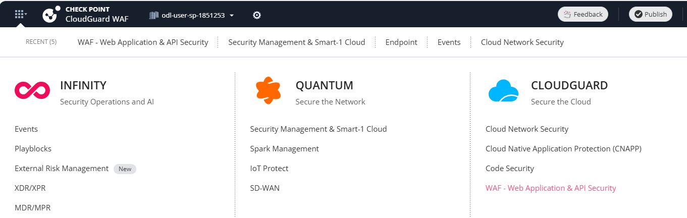

### Use Getting Started Wizard to protect first web site

1. Lets start in [Getting started section](https://portal.checkpoint.com/dashboard/appsec/cloudguardwaf#/waf-policy/getting-started)
with `Create New Asset` button.

2. Name asset `ip.iol.cz` and provide `Users will access the application / API at these URLs (1):` as `https://ip.iol.cz.yourname.on-waf.cloudguard.rocks` (replace `yourname` with string based on your actual unique name you used to register the tenant).
   - remember to hit `+` button to add the URL
   - make sure to use `https` scheme
   - full front-end URL e.g. `https://ip.iol.cz.yourname.odl-user-sp-1851253.on-waf.cloudguard.rocks`

3. Define `WAF / Reverse Proxy / Ingress will reach the application / API in this URL (2):` as `http://ip.iol.cz` (note the `http` scheme).

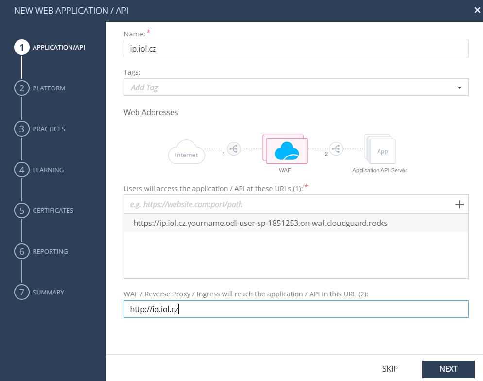

4. Select `new profile for asset`, deplyment method `SaaS`, region `Europe (Frankfurt)` 
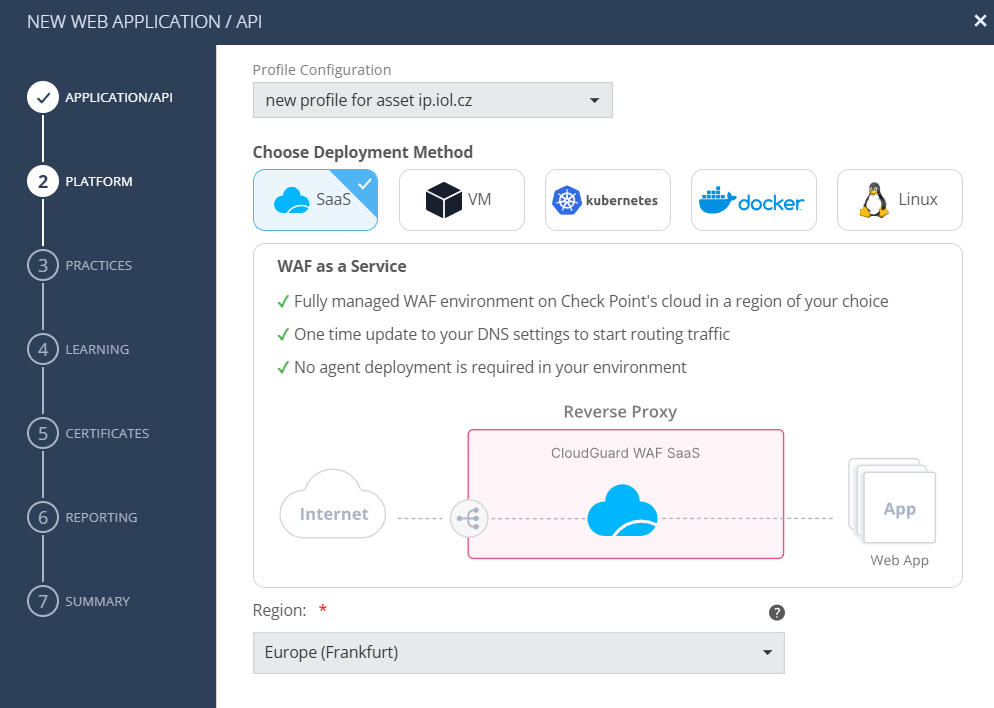

5. Select `Prevent` for web application and keep `Disabled` for API.
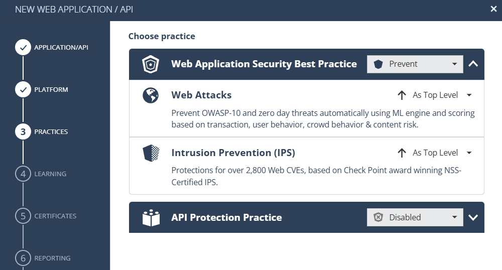

6. Stick to default Learning Engine identifies HTTP requests according to `X-Forward-For Header`
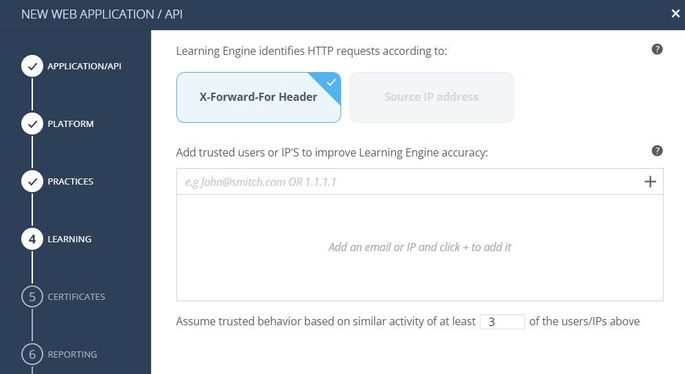

7. Let service issue certificate for you using AWS Certificate Manager
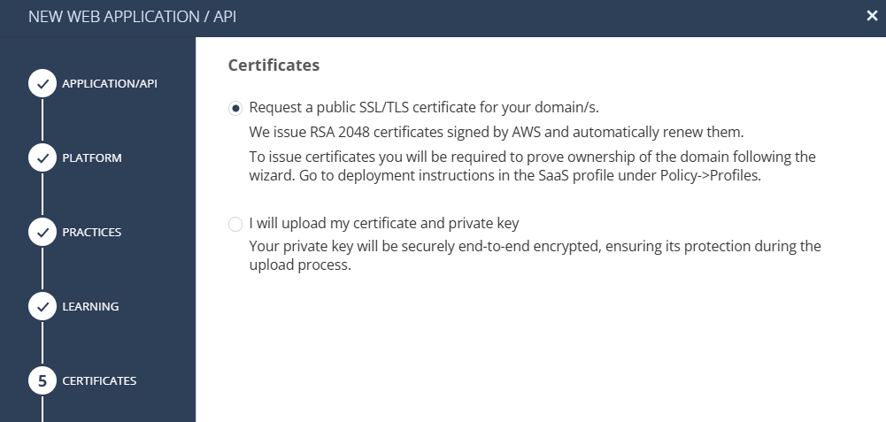

8. Finish the wizard with Publish & Enforce and wait for WAF SaaS Profile to open for you.

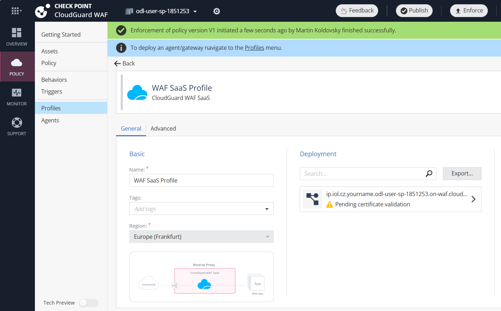

9. Now there are three more steps to do:
   - confirm domain ownership by adding CNAME record to your DNS zone (we will do it for you in on-waf.cloudguard.rocks zone)
   - obtain URL of service to be used by your users (frontend URL that we will also create for you in on-waf.cloudguard.rocks zone)
   - real server in production should be made accessible only from IP addresses of WAF SaaS service (web UI is presenting 3 IPs)

   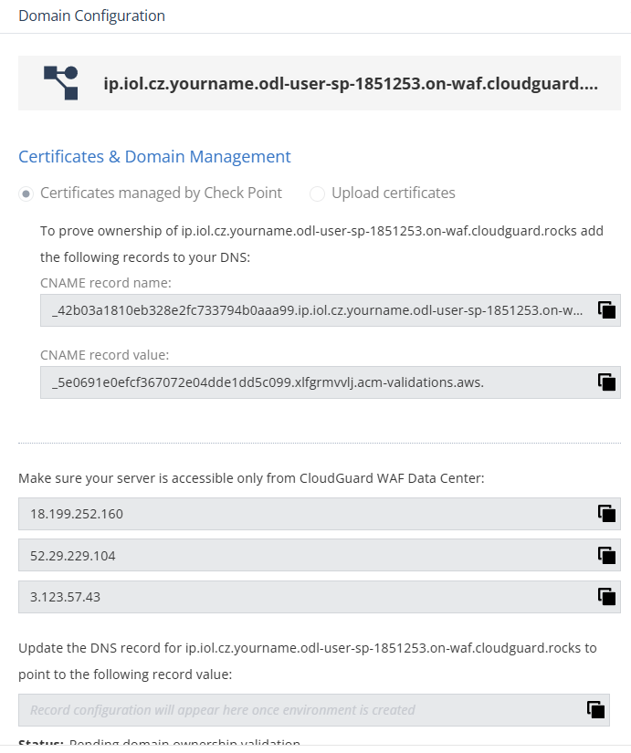

10. Lab only - we will do DNS changes using special tool based on WAF API keys. Go to Infinity Portal [API keys](https://portal.checkpoint.com/dashboard/settings/api-keys) and create new account API key pair for product `CloudGuard WAF`. Copy the values to clipboard like in screenshot below.
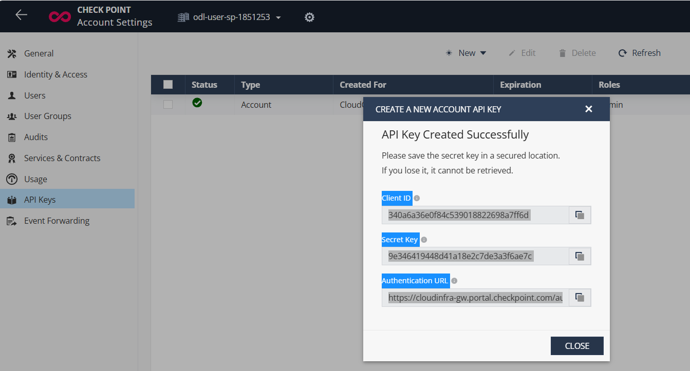

11. Open WAF lab DNS manager at https://waf-dns-manager-hiro-ea.deno.dev/go and paste API key data text into text area. Hit `Start` button.
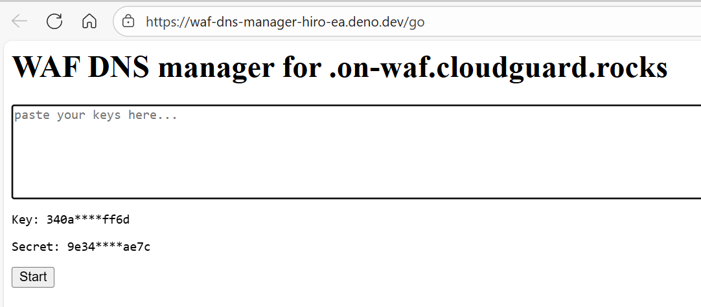 

12. Wait until tool confirms that DNS records were created. You should see two CNAME records - one to validate domain and one to point front-end URL to WAF SaaS service.
- check WAF SaaS profile page to see the actual state under your new front-end URL.

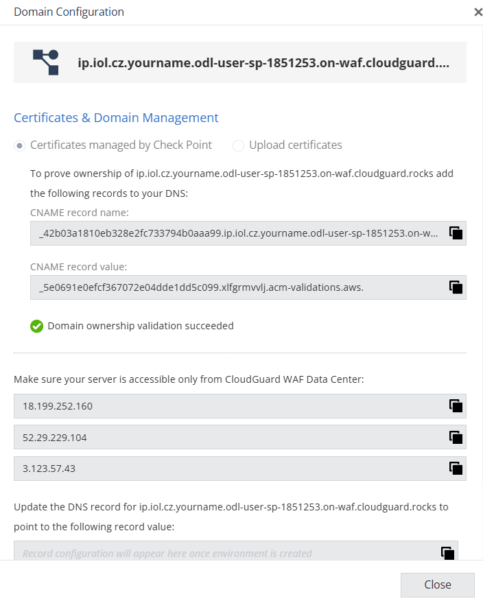

