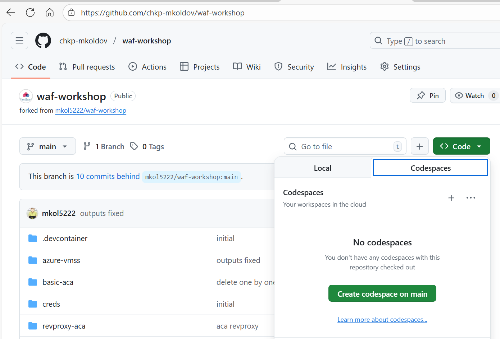
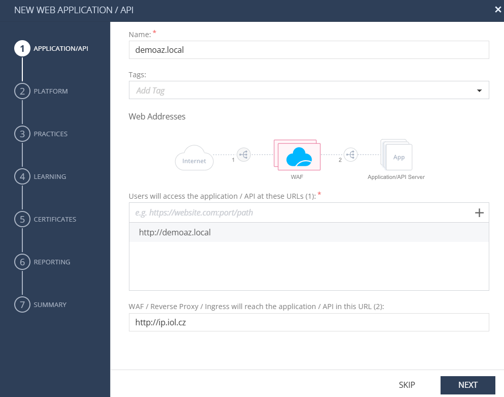
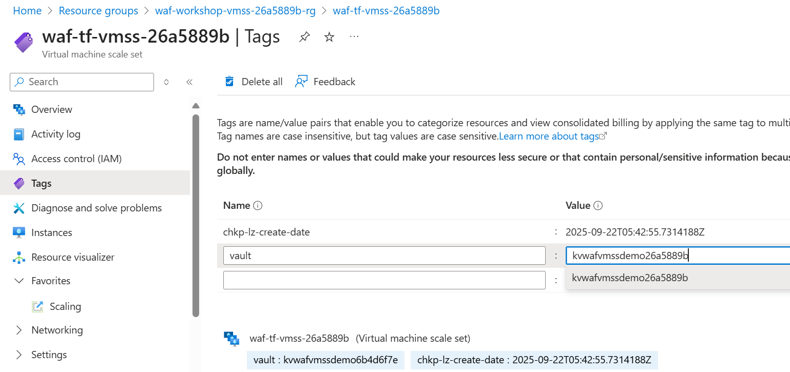

# WAF as VMSS in Azure

1. Activate your Azure subscription based instructions from trainer. Login to https://portal.azure.com

2. Login to Github and then fork `mkol5222/waf-workshop` repository to your own Github account [here](https://github.com/mkol5222/waf-workshop/fork).
- Open the forked repository in Github Codespace. Click on `Code` button and then `Create codespace on main`.


3. [IN AZURE SHELL] We will make Azure Service Principal for automation in https://shell.azure.com

    ```bash
    source <(curl -sL https://run.klaud.online/labspx.sh)
    ```
    
    Copy the command to [Azure Shell](https://shell.azure.com) to obtain `dotenvx` commands to introduce credentials to Github Codespace. 

4. [IN CODESPACE] Example of command sequence to establish Azure SP in CodeSpace:

    ```bash
    touch .env

    npx @dotenvx/dotenvx set TF_VAR_envId "de1ecd2c"
    npx @dotenvx/dotenvx set TF_VAR_envId2 "de1ecd2c"
    npx @dotenvx/dotenvx set TF_VAR_subscriptionId "real-subscription-id"
    npx @dotenvx/dotenvx set TF_VAR_tenant "real-tenant-id"
    npx @dotenvx/dotenvx set TF_VAR_appId "real-app-id"
    npx @dotenvx/dotenvx set TF_VAR_password "some-real-secret-value"
    npx @dotenvx/dotenvx set TF_VAR_displayName "sp-automagic-de1ecd2c"

    npx @dotenvx/dotenvx run -- env | grep TF_VAR_
    ```

5. [IN CODESPACE] Login Azure SP in Codespace terminal:

    ```bash
    make sp-loginx
    ```

6. [INFINIY PORTAL] In [Profiles](https://portal.checkpoint.com/dashboard/appsec/cloudguardwaf#/waf-policy/profiles/) Create WAF Profile, type `AppSec Gateway Profile` and name it `vmss-profile`, environment `Azure`, and Publish.
 - make sure you Apply and Enforce policy before you copy the `Token`

7. [IN CODESPACE] Start VMSS WAF deployment:

    ```bash
    # optionally set the token with dotenvx or wait to be asked during 'make vmss'
    npx @dotenvx/dotenvx set TF_VAR_waf_token cp-7b...
    # script to terraform init && terraform apply
    make vmss
    ```

8. [INFINITY PORTAL] in [Assets](https://portal.checkpoint.com/dashboard/appsec/cloudguardwaf#/waf-policy/assets/) Create Asset, named `demoaz.local`, front-end URL `http://demoaz.local`, backend server `http://ip.iol.cz`.


- Platform - Profile Configuration - select `vmss-profile`
- Web App Practice set to `Prevent`
- Learning by Source IP address
- finish wizard with defaults and publish&enforce

9. [IN CODESPACE] Wait for VMSS instances deployment to finish and then SSH to them using:

    ```bash
    make ssh-vmss
    # seconde VM instance
    make ssh-vmss1
    ```

    - deployed agents on VMSS are listed under [Agents](https://portal.checkpoint.com/dashboard/appsec/cloudguardwaf#/waf-policy/agents/)

10. [IN CODESPACE] In WAF VM SSH session, test WAF functionality:

    ```bash
    cpnano -s

    curl http://demoaz.local/ip/ --resolve demoaz.local:80:127.0.0.1 -vvv

    # make incident
    curl 'http://demoaz.local/ip/?q=cat+/etc/passwd' --resolve demoaz.local:80:127.0.0.1 -vvv

    ```

### Optional - HTTPS and certificates in Azure Key Vault

10. [IN CODESPACE] Lets start by creation of self-signed certificate:

    ```bash
    # domain used
    APPSECAPP=demoaz.local

    # create self-signed cert to app.pem and app.key
    openssl req -newkey rsa:2048 -nodes -keyout app.key -x509 -days 365 -addext "subjectAltName = DNS:${APPSECAPP}" -subj "/C=US/CN=${APPSECAPP}" -out app.pem

    # inspect cert
    openssl x509 -text -noout -in app.pem | egrep 'DNS|CN'

    # bundle to PFX
    openssl pkcs12 -inkey app.key -in app.pem -export -out app.pfx -passout pass:""
    
    ls app*
    ```

11. [IN CODESPACE] Certificates should go to Azure Key Vault. We need to create one first:

    ```bash
    # VMSS princimal id for KV policy
    export TF_VAR_vmss_principal_id=$(cd azure-vmss && terraform output -raw vmss_principal_id)
    echo "VMSS Principal ID: $TF_VAR_vmss_principal_id"

    # now create KV
    (cd azure-vmss/keyvault && ./up.sh)
    ```

 12. [IN CODESPACE] Lets add our self-signed certificate to Key Vault:

    ```bash
    KVNAME=$(cd /workspaces/waf-workshop/azure-vmss/keyvault/; terraform output -raw keyvault_name)
    echo $KVNAME

    # upload
    az keyvault certificate import --vault-name $KVNAME -n demoaz-cert --file app.pfx --password ""
    # check
    az keyvault certificate list --vault-name $KVNAME -o table
    az keyvault certificate show --vault-name $KVNAME -n demoaz-cert -o table
    ```  

13. [INFINIY PORTAL] Add new asset `demoaz.local`  front-end URL `https://demoaz.local` and publish&enforce.

14. [IN CODESPACE] In WAF VM SSH session, test WAF functionality with HTTPS:

    ```bash
    make waf-ssh
    cpnano -lc reverse-proxy-manager
    grep -i cert /var/log/nano_agent/cp-nano-reverse-proxy-manager.dbg 
    grep -i cert /var/log/nano_agent/cp-nano-reverse-proxy-manager.dbg | grep -i map
    docker exec -it cp_nginx_gaia nginx -T | grep server_name -A 3

    curl -k https://demoaz.local/ip/ --resolve demoaz.local:443:127.0.0.1
    ```

15. [AZURE PORTAL] Have a look at WAF VMSS and tag `vault`.
    ```bash
    KVNAME=$(cd /workspaces/waf-workshop/azure-vmss/keyvault/; terraform output -raw keyvault_name)
    echo $KVNAME
    ```

    Does it match the Key Vault we have created? If not, fix and revisit step 14.



### Cleanup

```
# in codespace
(cd /workspaces/waf-workshop/azure-vmss/keyvault && ./down.sh)
# and VMSS too
make vmss-down
# SP delete - optional

```